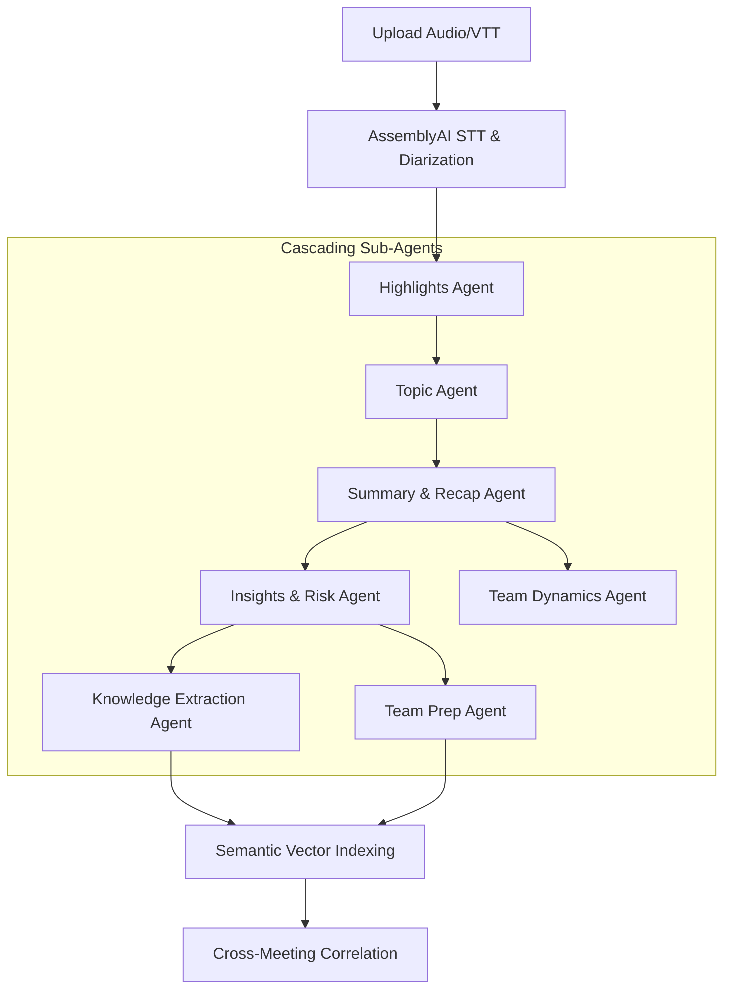
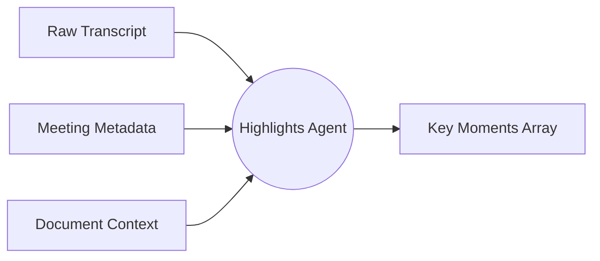
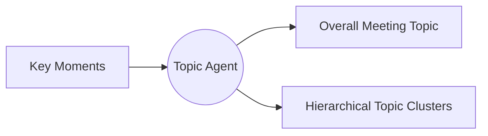
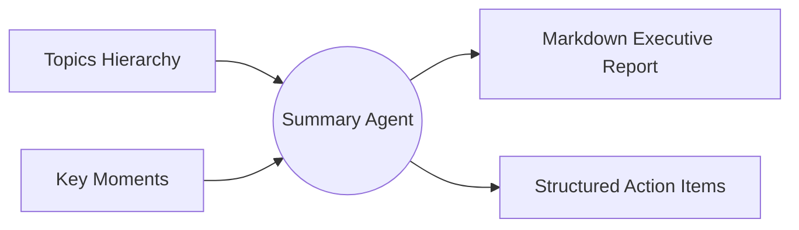
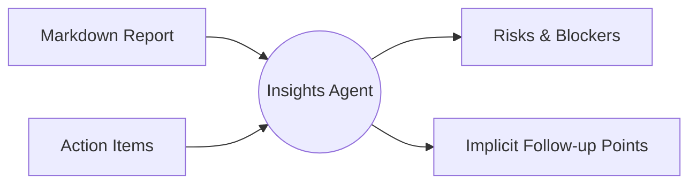
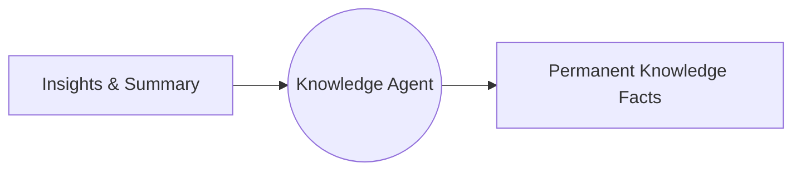
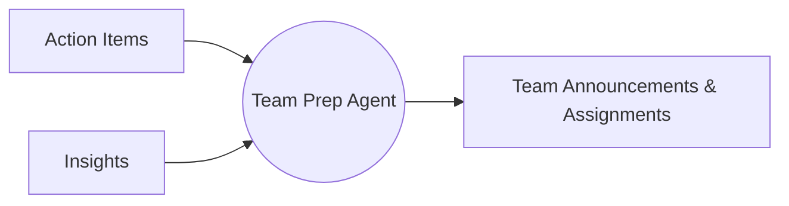
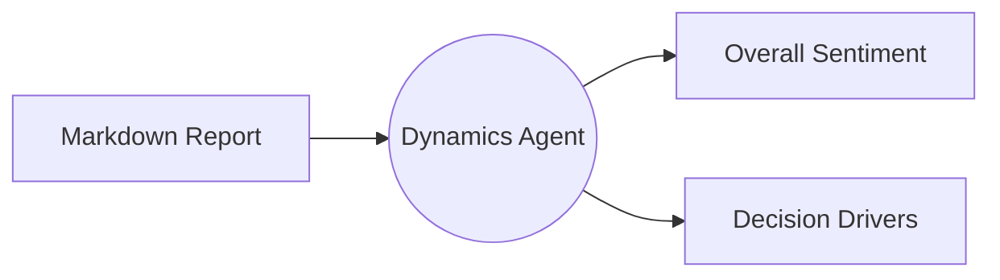
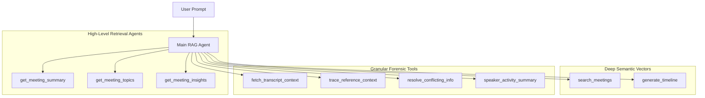

# Meet-Ink Project Architecture & System Report

Meet-Ink is an advanced Meeting Intelligence platform that processes raw meeting artifacts (audio, transcripts, slides), extracts actionable intelligence using a multi-stage LLM pipeline, and surfaces this knowledge through an autonomous, context-aware RAG agent.

---

## 1. System Components and Modules

The system is designed with a strict separation of concerns, heavily utilizing asynchronous event-driven patterns.

### Core Modules
* **FastAPI Backend (`app/api/`)**: Exposes REST endpoints for media upload, pipeline orchestration, meeting retrieval, and a streaming NDJSON endpoint for the RAG agent chat.
* **LangGraph Processing Pipeline (`app/pipeline/graphs/`)**: A directed acyclic graph of autonomous nodes responsible for dissecting meeting data into discrete, structured intelligence (Topics, Actions, Risks).
* **Meeting Service (`app/services/meeting_service.py`)**: The central orchestration service that bridges raw data ingestion, AssemblyAI transcription, file storage, and LangGraph execution.
* **Semantic Database Engine (`app/db/`)**: Powered by PostgreSQL and `pgvector`. It separates raw transcripts from semantic vectors (`MeetingSemanticChunk`) and structured metadata (`MeetingActionItem`, `MeetingTopic`).
* **Frontend (`frontend/src/`)**: A React-based web application utilizing Tailwind CSS. It features a robust `AgentChat` interface that automatically parses citation tags (e.g., `[km-1]`, `[doc-4]`) into glassmorphic, interactive data pills.

---

## 2. The Asynchronous Processing Pipeline & Background Agents

Instead of passing massive 10,000-word transcripts to a single LLM (which inevitably leads to hallucinations and missed details), Meet-Ink utilizes a **cascading multi-agent pipeline** built on LangGraph. Each "Node" in the graph acts as a highly specialized agent with a singular focus.

### Background Agent Deep Dive

Each background agent in the LangGraph pipeline is an autonomous node with a highly specific system prompt and data schema. By chaining them, the output of one agent becomes the constrained input of the next.

#### 1. Highlights Agent (`highlights_graph.py`)
**Design**: Acts as the initial filter. It scans raw conversational data and isolates critical turning points.

- **Working**: Analyzes the full VTT transcript. Extracts decisions or significant statements as "Key Moments". It explicitly maps each moment back to its source `utterance_ids` and any valid `doc_chunk_ids`.

#### 2. Topic Agent (`topic_segregation_graph.py`)
**Design**: Acts as the agenda synthesizer.

- **Working**: Entirely ignores the raw transcript. It reads only the `Key Moments` and clusters them into logical groups, determining the overarching theme of the meeting.

#### 3. Summary & Recap Agent (`summary_recap_graph.py`)
**Design**: The executive report writer.

- **Working**: Drafts a highly professional, readable Markdown summary. It is forced by prompt engineering to cite its claims using the `[km-1]` format. It also extracts concrete Action Items, assigning owners and deadlines.

#### 4. Insights & Risk Agent (`inferred_insights_graph.py`)
**Design**: The strategic analyzer.

- **Working**: Analyzes the surface-level summary to deduce underlying project risks, blockers, and implicit follow-up points that weren't explicitly stated but are required for success.

#### 5. Knowledge Extraction Agent (`knowledge_graph.py`)
**Design**: The long-term memory archivist.

- **Working**: Extracts permanent facts (e.g., "The Q3 architecture uses Postgres") and strips away temporary meeting context, saving them as universally true `MeetingKnowledgeFact` entities.

#### 6. Team Prep Agent (`team_prep_graph.py`)
**Design**: The communications drafter.

- **Working**: Translates raw action items and risks into polished, external-facing team announcements that can be pushed to Slack or Google Calendar.

#### 7. Team Dynamics Agent (`team_analysis_graph.py`)
**Design**: The behavioral psychologist.

- **Working**: Analyzes the tone and collaboration style of the meeting, identifying core decision drivers and the overarching sentiment (e.g., "Optimistic & Action-Oriented").

By cascading the output, the context window shrinks drastically at each step, focusing the LLM's attention and vastly improving output accuracy.

---

## 3. The Main Meet-Ink RAG Agent

The user-facing chat is powered by an advanced **ReAct (Reasoning + Acting) Agent**. 
Unlike standard chatbots, this agent possesses its own internal thought loop (`<thought>`) and is capable of utilizing 14 distinct database tools to forensically reconstruct context before answering the user.

### Detailed Tool Arsenal (All 14 Tools)

The agent possesses 14 distinct tools, categorized into four capabilities:

#### 1. High-Level Retrieval
1. **`get_meeting_summary`**: Fetches the explicitly generated Markdown executive report.
2. **`get_meeting_topics`**: Fetches the structural topic groupings and agenda hierarchy.
3. **`get_meeting_insights_and_risks`**: Fetches the automatically inferred high-level risks, blockers, and follow-ups.
4. **`get_meeting_metadata`**: Fetches basic top-level details (Title, Date, Duration, Participants) without searching vectors.

#### 2. Deep Semantic Search
5. **`search_meetings`**: Embeds the user's query and executes a cosine-distance search against `pgvector` to find relevant Key Moments, Topics, or Facts.
6. **`generate_timeline`**: Traces a specific topic across *multiple* historical meetings, building a chronological evolution of the project.
7. **`get_related_meetings`**: Instantly fetches cross-meeting links by traversing pre-computed graph edges (topic similarity > 75%), bypassing live vector searches.

#### 3. Granular Forensic Tools
8. **`fetch_transcript_context`**: If the agent finds a Key Moment but needs to know exactly what was said, it passes the `utterance_id` to this tool, which returns the exact 5 lines of dialogue preceding and following the moment.
9. **`fetch_document_reference`**: If an utterance references a specific slide, the agent uses this tool to read the OCR'd text from that exact presentation slide chunk.
10. **`trace_reference_context` (Vicinity Search)**: An extremely unique tool. If a transcript line says "Yes, let's do *that*", the agent can pass the ID to this tool. The backend pulls the preceding 20 lines and uses an internal sub-LLM to definitively resolve what "that" refers to, returning the answer to the main agent.
11. **`resolve_conflicting_information`**: If the agent notices two conflicting facts (e.g., "Deadline is Tuesday" vs "Deadline is Friday"), it passes both statements to this tool. The tool fetches both timestamps and uses a specialized LLM sub-agent to deduce the final overriding truth.

#### 4. Exact Entity Search
12. **`search_exact_transcript`**: Performs a case-insensitive keyword/lexical SQL search directly over the raw transcripts. Useful for finding exact names, acronyms, or specific phrases that semantic search might miss.
13. **`list_action_items_by_person`**: A direct relational SQL query targeting the `MeetingActionItem` table filtered by `owner`.
14. **`speaker_activity_summary`**: Filters the raw transcript for a specific speaker's name, returning everything they said in the meeting.

### Strict Citation Rules
The Main Agent operates under a heavily enforced system prompt that demands citations for *every* claim. It maps JSON tool responses to specific standard tags:
- Transcript Utterances: `[12]`
- Slides/Docs: `[doc-4]`
- Insights/Risks: `[ii-1]`
- Action Items: `[act-1]`
- Overall Summary: `[sum]`

---

## 4. Advanced Optimizations & Unique Techniques

### Token Consumption Optimization
* **Progressive Distillation**: Because the background pipeline cascades, later agents (like the Team Prep Agent) only consume ~800 tokens instead of the 15,000 token raw transcript, reducing overall processing cost by over 60%.
* **Granular Context Fetching**: The `fetch_transcript_context` tool uses a strict `context_window=5`, preventing the agent from dumping entire transcripts into its active memory buffer.

### Context Retention & Hallucination Guards
* **Citation Guard**: During the pipeline, the system tracks exactly which document chunks are allowed to be cited. If the LLM hallucinates a slide reference, the backend explicitly strips it out before saving to the database.
* **Metadata ID Forcing**: The agent is explicitly instructed to extract `utterance_id` and `chunk_id` from the hidden `Metadata` dictionary of search results, ensuring it always cites real, primary keys rather than inventing numbers.

### Scalability & Retrieval Speed
* **SQL + Semantic Hybrid**: The agent doesn't just rely on fuzzy semantic search. It is equipped with `list_action_items_by_person` and `search_exact_transcript`, allowing it to bypass vector space entirely and use lightning-fast Postgres `ILIKE` queries when looking for exact names or acronyms.
* **Normalized Edge Linking (`MeetingLink`)**: The system calculates cosine similarity between `Topic` chunks across different meetings in the background and saves them as graph edges. The agent can instantly traverse these pre-computed edges (`get_related_meetings`) without having to run expensive O(N) semantic searches across the entire database at query time.

---

## 5. External Integrations (Assumed Expansion)

Given the highly structured nature of Meet-Ink's database, integrating external tools is seamless:

### Linear Integration (Issue Tracking)
When the pipeline generates `MeetingActionItem` entities, an asynchronous webhook triggers. 
* **Mapping**: `owner` maps to the Linear Assignee, `text` maps to the Issue Title, and `deadline` maps to the Target Date.
* **Context**: The Linear ticket's description automatically embeds a deep-link back to the Meet-Ink transcript (`source_utterance_ids`), providing the engineer with the exact 30-second audio clip where the feature was discussed.

### Google Calendar Integration
* **Pre-Meeting Context**: Meet-Ink syncs with Google Calendar. When a meeting ends, the `team_prep` graph drafts announcements. These announcements are automatically patched into the Google Calendar Event Description, ensuring anyone who missed the meeting can read the executive summary directly in their calendar app.
* **Participant Sync**: The system maps Google Calendar attendees to Meet-Ink Voice Profiles, accelerating AssemblyAI's diarization accuracy by pre-loading known speakers.
